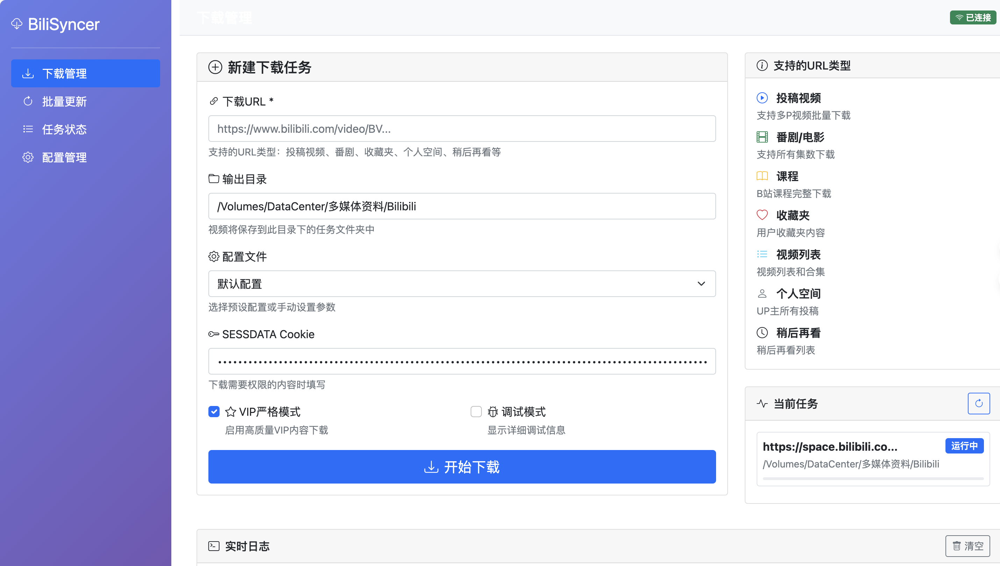
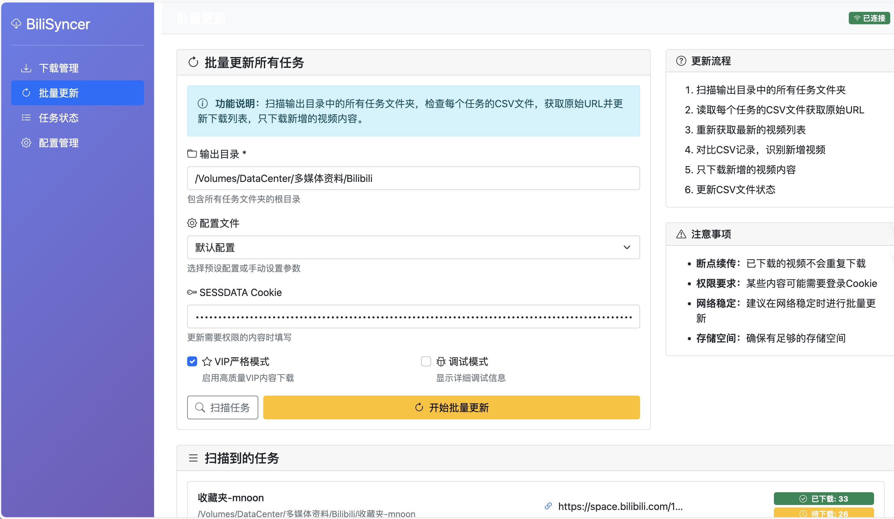
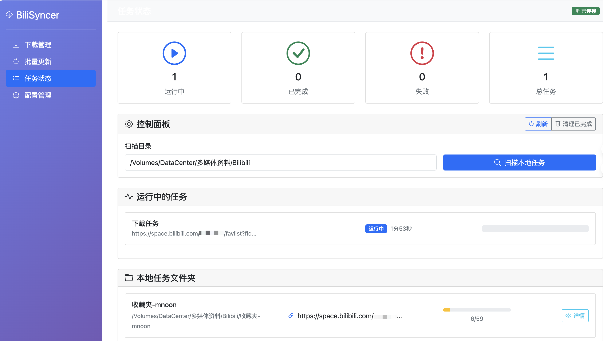
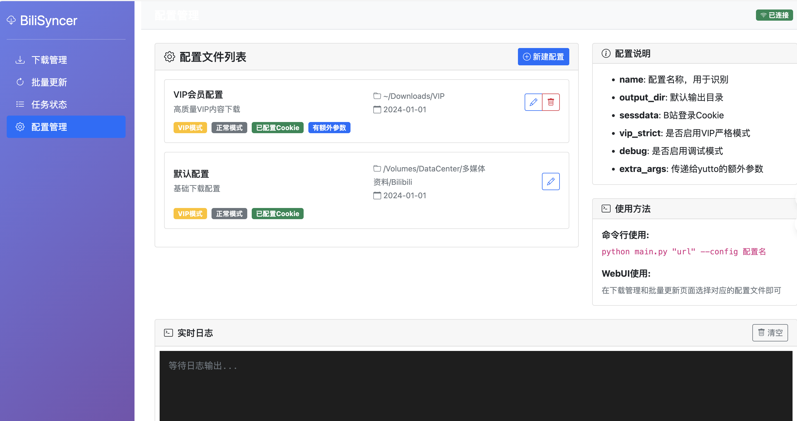

# BiliSyncer

🎯 **Intelligent Bilibili Content Synchronization Tool** - Batch download, resume support, and incremental updates

[](https://python.org)
[](LICENSE)
[](webui)

[🇨🇳 中文文档](README_ZH.md) | 🇺🇸 English

## 🌟 Overview

BiliSyncer is a professional Bilibili content management tool that extends yutto with advanced batch downloading, intelligent synchronization, and web-based management capabilities. Perfect for content creators, educators, and media enthusiasts who need systematic content management.

## ✨ Key Features

### 🔄 Intelligent Sync System
- **Batch Downloads** - Process multiple URLs simultaneously
- **Resume Support** - Automatically resume interrupted downloads
- **Incremental Updates** - Download only new content since last sync
- **Smart Status Tracking** - CSV-based progress management

### 📺 Comprehensive Content Support
- User videos & series | Anime & movies | Favorites & collections
- User spaces | Courses | Playlists | Watch later

### 🎨 Modern Web Interface
- Real-time progress monitoring | Task management dashboard
- Configuration management | One-click batch operations

### 🛡️ Robust & Reliable
- Advanced retry mechanisms | Network error handling
- Force stop capabilities | Cross-platform compatibility

## 🆚 BiliSyncer vs Yutto

| Feature | BiliSyncer | Yutto |
|---------|------------|-------|
| **Core Purpose** | Batch sync & management | Single/bulk downloads |
| **Web Interface** | ✅ Full-featured GUI | ❌ Command-line only |
| **Resume Downloads** | ✅ Automatic resume | ⚠️ Manual retry |
| **Incremental Updates** | ✅ Smart sync detection | ❌ Full re-download |
| **Status Tracking** | ✅ CSV-based management | ❌ No persistent state |
| **Batch Management** | ✅ Multi-task dashboard | ❌ Single task focus |
| **Content Organization** | ✅ Auto folder structure | ⚠️ Basic organization |
| **Task Monitoring** | ✅ Real-time progress | ❌ Terminal output only |
| **Configuration** | ✅ Web + YAML configs | ⚠️ Command args only |
| **Update Workflow** | ✅ One-click batch updates | ❌ Manual re-execution |

**BiliSyncer = Yutto + Batch Management + Web Interface + Sync Intelligence**

## 📱 Interface Preview

### Download Management


### Batch Updates


### Task Status


### Configuration Management


## 🚀 Quick Start

### Prerequisites
```bash
# Install dependencies
pip install yutto
pip install -r requirements.txt
```

### Launch Web Interface
```bash
python start_webui.py
# Visit http://localhost:5000
```

### Command Line Usage
```bash
# Single download
python main.py "https://www.bilibili.com/video/BV1xx411c7mD"

# Batch update all configured tasks
python main.py --update -c "SESSDATA"

# Use custom configuration
python main.py "URL" --config vip
```

## 🔧 Configuration

Create `config/your_config.yaml`:
```yaml
name: "My Config"
output_dir: "~/Downloads"
sessdata: "your_sessdata_here"
vip_strict: true
extra_args: ["--quality", "8K"]
```

**Getting SESSDATA**: Login to bilibili.com → F12 → Application → Cookies → Copy `SESSDATA` value

## 🎯 Perfect For

- **Content Creators** - Backup and organize your content library
- **Educators** - Download course materials and educational content
- **Media Collectors** - Systematically manage anime, series, and favorites
- **Researchers** - Batch download reference materials

## 🛠️ Tech Stack

Built with Python 3.8+, Flask, yutto, and modern web technologies for reliability and performance.

## 🤝 Contributing

We welcome contributions! Submit Issues or Pull Requests to help improve BiliSyncer.

## 📜 License

MIT Licensed - see [LICENSE](LICENSE) for details.

---

⭐ **Star this project if it helps you manage your Bilibili content!** 