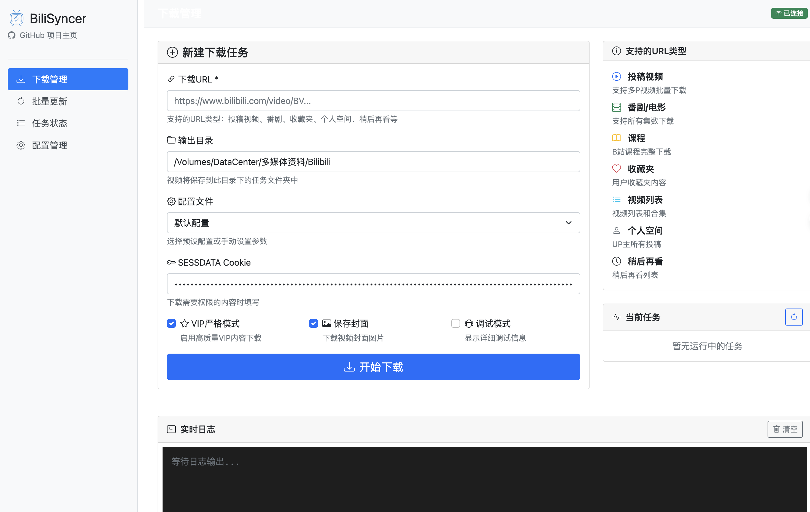
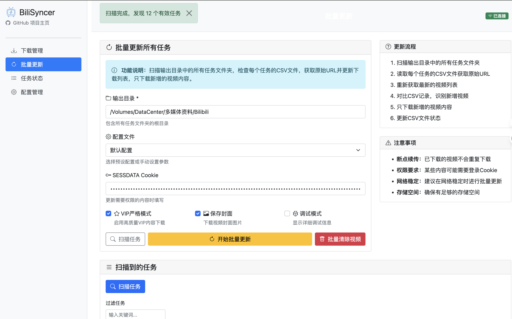
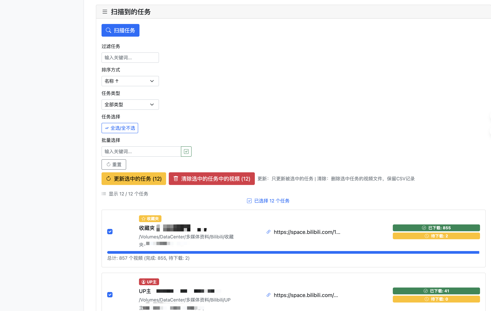
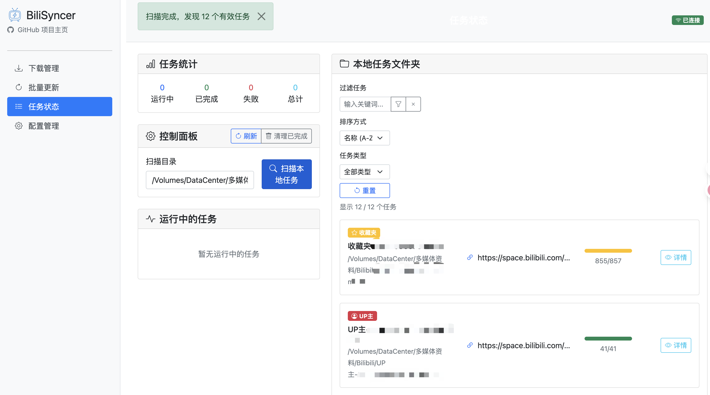
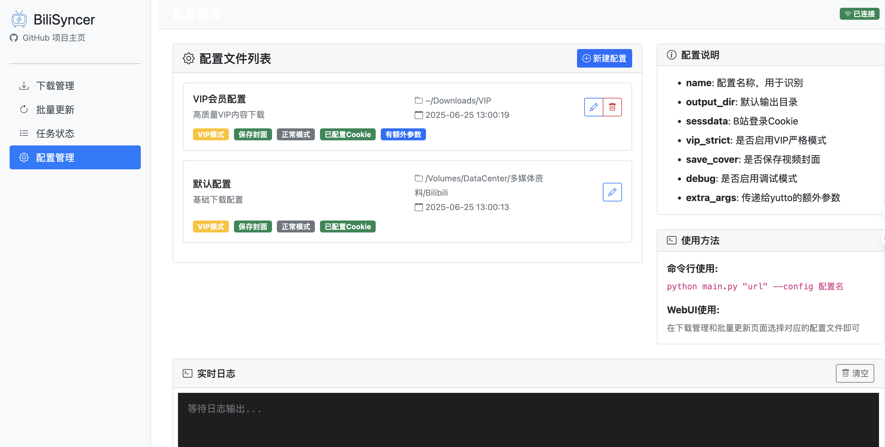

<div align="center">
  
  
  # BiliSyncer

  🎯 **智能的B站内容同步工具** - 自动同步管理、增量更新、批量下载
</div>

[](https://python.org)
[](LICENSE)
[](webui)

🇨🇳 中文 | [🇺🇸 English](README.md)

## 🌟 项目简介

BiliSyncer 是一个专为B站内容持续更新资源设计的智能同步管理工具。专注于解决用户收藏夹、UP主投稿、新番动画等持续更新内容的自动化同步难题，在 yutto 基础上构建了完整的资源管理生态，让内容管理变得简单高效。

## ✨ 核心优势

### 🎯 智能资源获取与识别
- **精准资源定位** - 自动获取收藏夹、UP主投稿等完整准确的视频清单，无遗漏无冗余
- **智能更新检测** - 自动识别自上次同步后的所有新增内容，避免重复请求和无效操作
- **多平台内容支持** - 全面支持投稿视频、番剧、电影、课程、收藏夹、合集等多种内容类型

### 🔄 先进的同步管理机制
- **增量同步技术** - 仅同步新增和变更内容，大幅节省时间和带宽资源
- **断点续传保障** - 网络中断或意外停止后自动恢复，确保下载任务的连续性
- **状态持久化跟踪** - 基于CSV文件的进度管理，确保同步记录永不丢失

### 🧹 一键清理与空间管理
- **智能清理功能** - 备份完成后支持一键清理所有下载文件，释放存储空间
- **记录保留机制** - 清理文件的同时完整保留下载记录，为后续增量同步提供基础
- **存储优化策略** - 灵活的文件管理策略，适应不同的存储需求场景

### ⚙️ 多样化配置管理
- **多账号支持** - 支持多个B站账号的独立配置和管理，满足不同权限需求
- **差异化配置** - 针对不同下载需求提供独立的参数配置方案
- **配置模板化** - 预设常用配置模板，快速应用到不同任务场景

### 📊 可视化监控与分析
- **实时任务监控** - 直观显示所有同步任务的执行状态和进度信息
- **历史记录分析** - 自动统计同步历史，提供详细的任务执行报告
- **资源状态总览** - 一目了然地查看所有资源的同步状态和存储信息

### 🔧 精细化任务调度
- **并发任务管理** - 支持多任务并行执行，最大化利用系统资源
- **任务生命周期控制** - 提供任务的启动、暂停、停止、重启等完整控制功能
- **优先级调度** - 支持任务优先级设置，优先处理重要资源

### 🎨 直观友好的Web界面
- **现代化设计** - 简洁美观的响应式Web界面，适配各种设备
- **操作简便性** - 直观的操作流程，降低学习成本，提升用户体验
- **功能集成度** - 所有管理功能集中在统一界面，避免复杂的命令行操作

### ⚡ 高效的命令行接口
- **批处理能力** - 强大的CLI支持，方便脚本调用和自动化集成
- **参数灵活性** - 丰富的命令行参数，满足高级用户的精细化控制需求
- **程序集成友好** - 易于集成到其他自动化系统和工作流中

## 🆚 BiliSyncer vs Yutto vs Yutto-uiya

| 功能特性 | BiliSyncer | Yutto | Yutto-uiya |
|---------|------------|-------|------------|
| **核心定位** | 持续同步管理 | 强大的CLI下载器 | 简单的网页封装 |
| **同步能力** | ✅ 智能增量同步 | ➖ 需手动重新执行 | ➖ 需手动重新执行 |
| **资源管理** | ✅ 完整生命周期管理 | ➖ 仅下载功能 | ➖ 仅下载功能 |
| **界面类型** | 专业Web仪表板 | 强大命令行界面 | 友好的Streamlit界面 |
| **下载引擎** | 基于yutto构建 | 原创强大引擎 | 基于yutto构建 |
| **批量操作** | ✅ 多任务管理 | ✅ 批量下载支持 | ✅ 基础批量支持 |
| **断点续传** | ✅ 自动检测恢复 | ✅ 内置续传功能 | ✅ 继承yutto续传 |
| **状态持久化** | ✅ CSV文件跟踪 | ➖ 仅会话状态 | ➖ 仅会话状态 |
| **配置管理** | ✅ Web + YAML管理 | ✅ 丰富CLI选项 | ✅ 简单网页表单 |
| **内容组织** | ✅ 结构化文件夹命名 | ✅ 灵活路径模板 | ✅ 基础组织方式 |
| **学习曲线** | 🟢 新手友好 | 🟡 技术用户 | 🟢 非常简单 |
| **适用场景** | 持续内容管理 | 专业用户下载 | 休闲下载使用 |

### 🎯 各工具特色

**Yutto**: 强大基础 - 高性能、高可配置的CLI工具，为技术用户提供最大控制力和性能。

**Yutto-uiya**: 易用桥梁 - 通过简洁的Web界面将yutto的强大功能带给普通用户，无需复杂配置。

**BiliSyncer**: 管理层面 - 专注于持续更新内容的自动化同步管理，提供完整的资源生命周期解决方案。

## 📱 界面预览

### 下载管理界面


### 批量更新界面



### 任务状态界面


### 配置管理界面


## 🚀 快速开始

### 环境准备
```bash
# 安装依赖
pip install yutto
pip install -r requirements.txt
```

### 启动Web界面
```bash
python start_webui.py
# 访问 http://localhost:5000
```

### 命令行使用
```bash
# 单次下载
python main.py "https://www.bilibili.com/video/BV1xx411c7mD"

# 带附加选项
python main.py "URL" --vip-strict --save-cover

# 批量更新所有配置任务
python main.py --update -c "SESSDATA"

# 使用自定义配置
python main.py "URL" --config vip
```

## 🔧 配置说明

创建 `config/your_config.yaml`：
```yaml
name: "我的配置"
output_dir: "~/Downloads"
sessdata: "your_sessdata_here"
vip_strict: true
save_cover: true
extra_args: ["--quality", "8K"]
```

**获取SESSDATA**：登录 bilibili.com → F12 → Application → Cookies → 复制 `SESSDATA` 值

## 🎯 适用场景

- **内容创作者** - 持续跟踪和备份关注UP主的最新投稿
- **教育工作者** - 自动同步课程更新和教育资源
- **媒体收藏者** - 智能管理收藏夹和追番列表的更新
- **研究人员** - 自动化收集和整理研究相关的视频资料

## 🛠️ 技术栈

基于 Python 3.8+、Flask、yutto 和现代Web技术构建，确保可靠性和性能。

## 🤝 贡献指南

欢迎贡献！提交 Issues 或 Pull Requests 来帮助改进 BiliSyncer。

## 📜 许可证

MIT 许可证 - 详见 [LICENSE](LICENSE) 文件。

---

⭐ **如果这个项目帮助你管理B站内容，请给个Star支持！** 